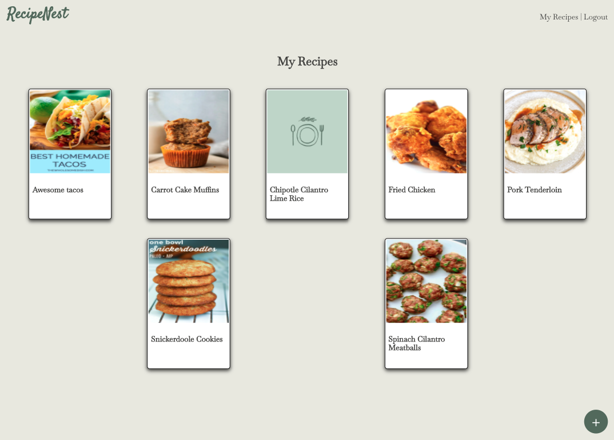
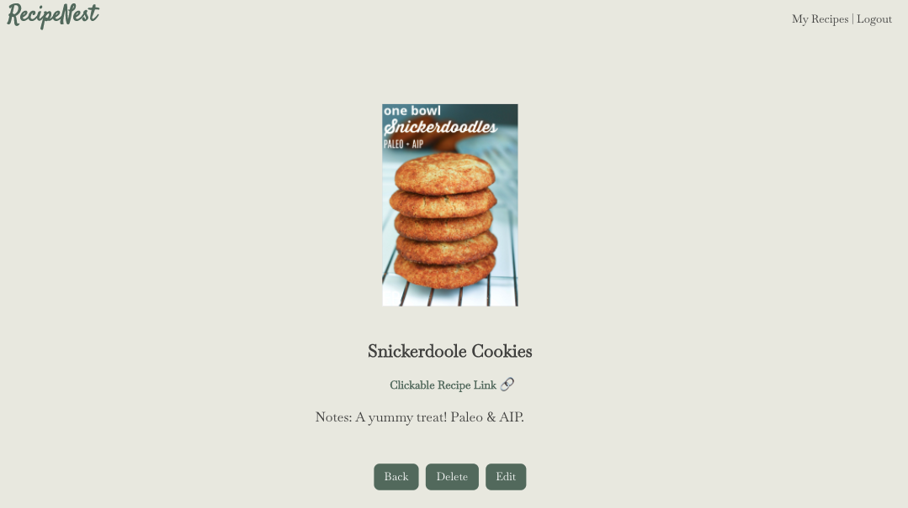
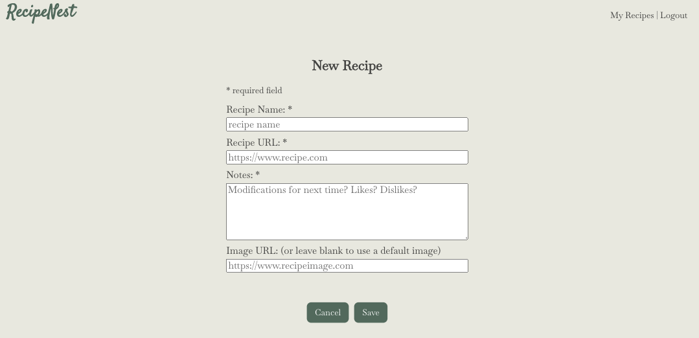

# RecipeNest App

RecipeNest is a responsive web application that allows users to keep track of their virtual recipe notes. This project was bootstrapped with [Create React App](https://github.com/facebook/create-react-app).

## Live Demo

Click [here](https://recipenest.vercel.app/).

**Note: currently, the server and database need to be running *locally* for the fullstack application to work as expected.**

## Screenshots

### Login Page:

### My Recipes Page

### Recipe Page

### New Recipe Page

## Summary

This app allows users to easily keep track of their virtual recipe notes. The app requires authentication so a user has to sign up for an account or, if they would like to simply tour the app and get a feel for how it works, demo login credentials are provided in the Live Demo landing page. Once logged in, a user can see all of their previously saved recipe entries. They can add a new recipe by including the link to the virtual recipe, the recipe name, any notes, and an image url to be displayed on the My Recipes page. A user can also edit or delete previously saved recipes.

## Built With

* React
* CSS
* JavaScript

## Ideas For Future Features

* Pagination
* Search Functionality